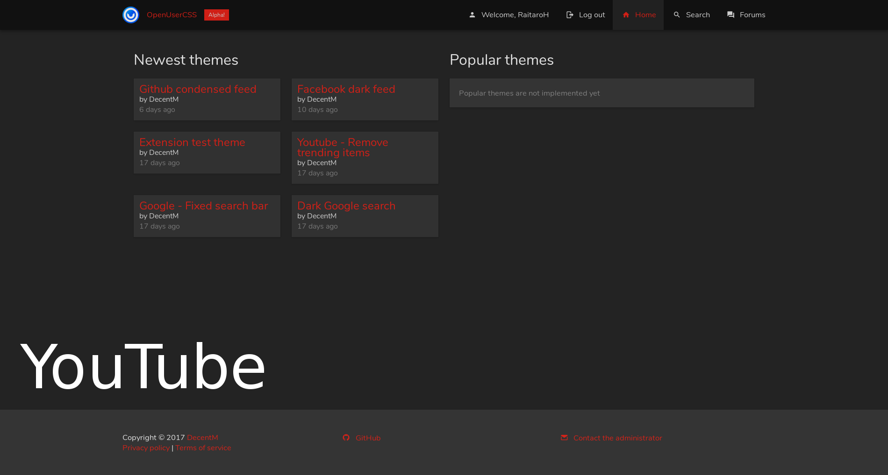

# OpenUserCSS-DeepDark

Host your code in the dark. May the dark be kinder on thine eyes. (openusercss.org dark theme)

**The official dark theme for [OpenUserCSS](https://openusercss.org).**

This is a dark theme for OpenUserCSS inspired by [FT DeepDark](https://addons.mozilla.org/en-US/firefox/addon/ft-deepdark/?src=search).

Also, credit where credit is due for the color palettes down bellow. ([@KDE](https://github.com/KDE), [@horst3180](https://github.com/horst3180), [@linuxmint](https://github.com/linuxmint), [Firefox](https://www.mozilla.org/en-US/firefox/new/), [YouTube](https://www.youtube.com/) and [Discord](https://discordapp.com/))

Theme as a userstyle [here](https://openusercss.org/theme/5a4605de961b8c0b001f2476).

**You can also install all my themes at once from [here](https://github.com/RaitaroH/Import-All-Deepdark).**

# Screenshots
Main website

Forum

# Colors
The colors are available in the code; different colors can be used.

